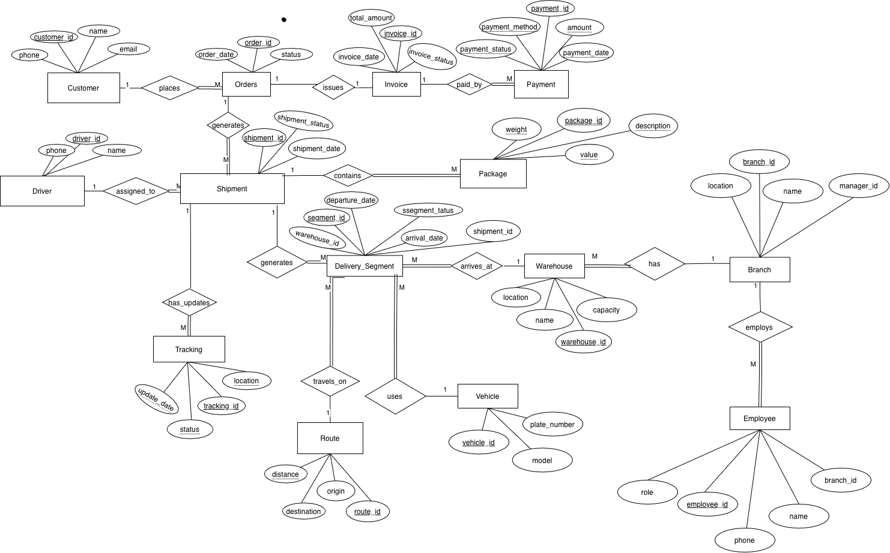

# Logistics Data Analysis Project

## 📌 Project Overview
This project demonstrates SQL-based data analysis using a relational database designed for a logistics and delivery management system.

The goal of this project is to extract business insights from operational data using structured SQL queries.

---

## 🗂 Database Structure
The database includes the following key entities:

- Customer  
- Orders  
- Shipment  
- Package  
- Invoice  
- Payment  
- Branch  
- Employee  
- Delivery_Segment  
- Route  
- Vehicle  

The schema is fully normalised to Third Normal Form (3NF) and implemented in MySQL.

---

## 📊 Business Questions Answered

This project answers analytical questions such as:

- How many shipments are processed per branch?
- What is the total revenue generated?
- Which invoices remain unpaid?
- Which customers generate the highest revenue?
- What is the average shipment value?

---

## 🛠 Tools Used
- MySQL  
- SQL (Joins, Aggregation, Group By, Filtering)  
- phpMyAdmin  
- Relational Database Design  

---

## 🚀 Skills Demonstrated
- Relational database querying
- Multi-table joins
- Aggregation functions
- Data summarisation
- Business insight extraction
## 🧩 Entity Relationship Diagram (ERD)

---
- Identified total shipments handled per branch
- Calculated total revenue generated
- Detected unpaid invoices for financial monitoring
- Analyzed shipment status distribution
This project forms part of my journey toward becoming a Data Analyst.
